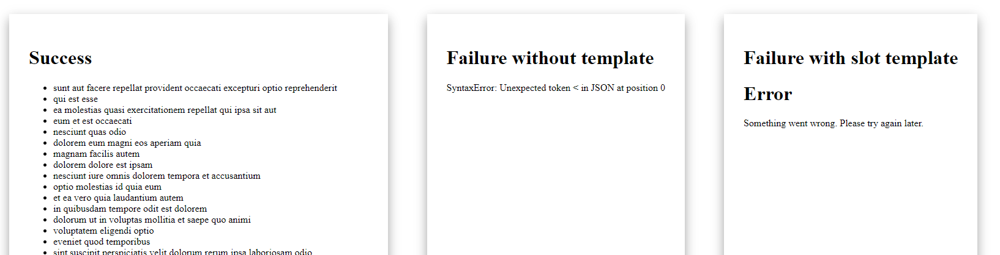

# Error boundaries

Each pure-lit component will handle errors and not propagate them. Async functions will also show the error message, and allow you to create custom error templates by specifing slots.

Take for example a simple list that looks like this:

```js
pureLit(
  "posts-list",
  async (element) => {
    const data = await fetch(element.src).then((response) => response.json());

    return html`<ul>
      ${data.map((entry) => html`<li>${entry.title}</li>`)}
    </ul>`;
  },
  {
    defaults: { src: "" },
  }
);
```

Imagine the follow three usages in a page:

```html
<div>
  <h1>Success</h1>
  <posts-list src="https://jsonplaceholder.typicode.com/posts"> Please wait while loading... </posts-list>
</div>
<div>
  <h1>Failure without template</h1>
  <posts-list src="404"> Please wait while loading... </posts-list>
</div>
<div>
  <h1>Failure with slot template</h1>
  <posts-list src="404">
    Please wait while loading...
    <div slot="error">
      <h1>Error</h1>
      <p>Something went wrong. Please try again later.</p>
    </div>
  </posts-list>
</div>
```

This will result in the following representation:



The successful one will show the list. The failing one without a `slot="error"` will show the error message, whereas the last one with the slot will display the slot.