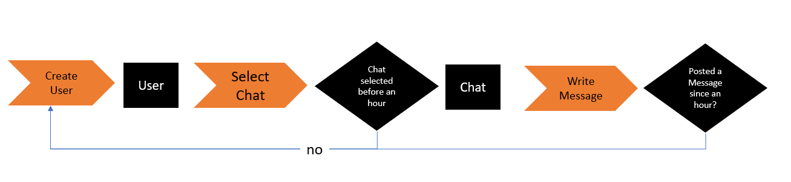

# State

State handling is provided by the two external libraries

* [lit-element-state-decoupler](https://github.com/MatthiasKainer/lit-element-state-decoupler) - `useState`, `useReducer` and `useWorkflow` hooks
* [lit-element-effect](https://github.com/MatthiasKainer/lit-element-effect) - `useEffect` and `useOnce` hooks

See their respective repositories if there are open questions after these paragraphs.

## useState

Getting access to the state can be done by calling the `useState` function.

This should be done on one location in the lifecycle, and not inside a loop with
a changing number of iterations because it tries to re-resolve the correct
element from the previous run.

```typescript
pureLit("demo-element", element => {
    const {get, set, value, subscribe} = 
        useState<YourState>(element, defaultState, options)
})
```

Depending on your preferences you can either use the `get` & `set` functions, or the `value` property.

```typescript
const first = useState(element, defaultState);
const { value: second } = useState(element, defaultState);
return html`
    <button @click=${() => first.set(first.get() + 1)}>
        First State: ${first.get()} - click on me to increment
    </button>
    <button @click=${() => (second = second + 1)}>
        Second State: ${second} - click on me to increment
    </button>
`;
```

The behaviour is the same, and can even be mixed

```typescript
const { get, set, value } = useState(element, defaultState);
return html`
    Variant State: ${value}
    <button @click=${() => set(value + 1)}>
         click on me to increment
    </button>
    <button @click=${() => (value = get() + 1)}>
        Or click on me to increment
    </button>
`;
```

### Options

| variable                                  | description                                                                       |
| ----------------------------------------- | --------------------------------------------------------------------------------- |
| `updateDefauls: boolean` (default: false) | If set to true, updates the state with the default values every time it is called |

The state exposes three functions, `get`, `set` and `subscribe`, and takes in a
reference to the current LitElement and a default state. Whenever the state is
updated, the LitElement will be updated, and the `render()` method of the
component will be called.

```typescript
pureLit("demo-element", element => {
    const {get, set} = useState<StateExample>(element, { values: [] })
    return html`
        <button @click="${() => set([...get(), "lala"])}">Add value</button>
        <textarea>${get().values.join(",")}</textarea>
    `
})
```

| function                                  | description                                                 |
| ----------------------------------------- | ----------------------------------------------------------- |
| get() => YourState                        | Returns the current state                                   |
| set(newState: YourState) => Promise&lt;void>          | Updates the state to a new state                            |
| subscribe(yourSubscriberFunction) => void | Notifies subscribed functions if the state has been changed |

## useReducer

Getting access to the reducer can be done by calling the `useReducer` function.

This should be done on one location in the lifecycle, and not inside a loop with
a changing number of iterations because it tries to re-resolve the correct
element from the previous run.

```typescript
pureLit("demo-element", element => {
    const {get, set, subscribe} = useReducer<YourState>(element, yourReducer, defaultState, options?)
})
```

Similar to the state, the reducer exposes three functions, `get`, `set` and
`subscribe`, and takes in a reference to the current LitElement and a default
state. In addition, it also requires a reducer function and can directly trigger
custom events that bubble up and can be used by the parent.

Whenever the state is updated, the LitElement will be updated, and the
`render()` method of the component will be called.

### Reducer Function

The reducer follows a definition of
`(state: T, payload: unknown) => {[action: string]: () => T}`, so it's a
function that returns a map of actions that are triggered by a specific action.
Other then in `redux`, no default action has to be provided. If the action does
not exist, it falls back to returning the current state.

An example implementation of a reducer is thus:

```typescript
class StateExample {
  constructor(public values = []) {}
}

const exampleReducer = (state: StateExample) => ({
  add: (payload: string) => ({ ...state, value: [...state.values, payload] }),
  empty: () => ({ ...state, value: [] }),
});
```

### Options

| variable                                  | description                                                                       |
| ----------------------------------------- | --------------------------------------------------------------------------------- |
| `dispatchEvent: boolean` (default: false) | If set to true, dispatches a action as custom event from the component            |
| `updateDefauls: boolean` (default: false) | If set to true, updates the state with the default values every time it is called |


### Arguments

| function                                      | description                                                        |
| --------------------------------------------- | ------------------------------------------------------------------ |
| get() => YourState                            | Returns the current state                                          |
| set(action: string, payload: unknown) => void | Triggers the defined `action` on your reducer, passing the payload |
| subscribe(yourSubscriberFunction) => void     | Notifies subscribed functions when the state has been changed      |
| when(action, yourSubscriberFunction) => void  | Notifies subscribed functions when the action has been triggered   |

#### set

The reducer can be triggered whenever the reducer's `set` function is triggered,
i.e.

```typescript
pureLit('example-element', element => {
    const {set, get} = useReducer<StateExample>(element, exampleReducer, { values: [] });
    return html`
        <button @click="${() => set("add", "lala")}">Add value</button>
        <button @click="${() => set("empty")}">Clean</button>
        <textarea>${get().values.join(",")}</textarea>
    `
})
```

#### set with custom events

If specified in the options, the set will also be dispatched as a custom event.
An example would look like this:

```typescript
class StateExample {
  constructor(public values = []) {}
}

const exampleReducer = (state: StateExample) => ({
  add: (payload) => ({ ...state, value: [...state.values, payload] }),
});

pureLit('demo-clickme', element => {
  const { set, get } = useReducer<StateExample>(element, exampleReducer, 0, { 
    dispatchEvent: true,
  });

  return html`<button @click="${() => set("add", 1)}">
    Clicked ${get()} times
  </button>`;
  })

  // usage
  html`<demo-clickme @add="${(e: CustomEvent<StateExample>) => console.log(e.detail)}">
  </demo-clickme>
  `;
```

#### Subscribe to seted events

For side effects it might be interesting for you to listen to your own
dispatched events. This can be done via `subscribe`.

Usage:

```typescript
const { set, get, subscribe } = useReducer<StateExample>(
  element,
  exampleReducer,
  0,
);

subscribe((action, state) =>
  console.log("Action triggered:", action, "State:", state)
);

return html`
    <button @click="${() => set("add", 1)}">Clicked ${get()} times</button>
`;
```

In case you want to listen to a single action you can use the convenience method
`when`.

```typescript
const { set, get, when } = useReducer<StateExample>(element, exampleReducer, 0);

when("add", (state) => console.log("Add triggered! State:", state));

return html`
    <button @hover="${() => set("highlight")}" @click="${() =>
  set("add", 1)}">Clicked ${get()} times</button>
`;
```


## One way flow

Both `useState` and `useReducer` have an option to `updateDefauls: boolean`
(default: false). If set to true, it updates the state with the default values
every time it is called. This is handy for one-way data binding. One example
could be a list like:

```typescript
const { set } = useReducer(element, listReducer, [...element.items], {
  dispatchEvent: true,
  updateDefauls: true,
});
return html`<input
    type="text"
    @keypress=${(e: KeyboardEvent) => {
      const element = (e.target as HTMLInputElement);
      if (element.value !== "" && e.key === "Enter") {
        set("add", element.value);
        element.value = "";
      }
    }}
    />
    <ul>
    ${element.items.map((todo) => html`<li>${todo}</li>`)}
    </ul>
`;
```

if this is used in a page like this

```typescript
<list-element .items=${get()} @add=${(e) => set(e.details)}>
</list-element>
```

Changing the attribute has been fully delegated to the user, while the control
itself can still change it.

## Avoiding endless state updates

Imaging a scenario where you need get some information from an endpoint you'd
would want to store in the state. So you fetch it, and set it. An example would
look like this:

```typescript
pureLit("demo-element", element => {
    const {get, set} =
        useReducer<Notifications>(element, NotificationReducer, { status: "Loading" })
    fetch("/api/notifications")
        .then(response => response.json())
        .then(data => set("loaded", data))
        .catch(err => set("failed", err))

    const { status, notifications } = get()
    switch(status) {
        case "Error": return html`An error has occured`;
        case "Success": return html`<notification-table .notifications="${notifications}"></notification-table>`
    }
    return html`Please wait while loading`;
})
```

Unfortunately, this will lead to an endless loop. The reason is the following
flow:

```txt
+--------------------------------+
|                                |
+--> render -> fetch -> set +----+
```

The render triggers the fetch, which triggers a set. A set however triggers a
render, which triggers a fetch, which triggers a set. This triggers a render,
which triggers a fetch, which triggers a set. All of that forever, and really
fast.

While deploying this is great to performance test your apis, and might not be
the original plan. To work around this, you might want to use the `useEffect` 
and `useOnce` hooks, which allows you to execute a certain callback only once, 
or if something changes.

```typescript
pureLit("demo-element", element => {
    const {get, set} =
        useReducer<Notifications>(element, NotificationReducer, { status: "Loading" })
    useOnce(element, () => {
        fetch("/api/notifications")
            .then(response => response.json())
            .then(data => set("loaded", data))
            .catch(err => set("failed", err))
    })

    const { status, notifications } = get()
    switch(status) {
        case "Error": return html`An error has occured`;
        case "Success": return html`<notification-table .notifications="${notifications}"></notification-table>`
    }
    return html`Please wait while loading`;
})
```

With this little addition it is ensured that the fetch will be called only once.
Accordingly, if you want to call the fetch on a property change only, use the
`useEffect` hook as follows:

```typescript

pureLit("demo-element", element => {
    const {get, set} =
        useReducer<Notifications>(element, NotificationReducer, { status: "Loading" })
    useEffect(element, () => {
        fetch(`/api/notifications/${element.user}`)
            .then(response => response.json())
            .then(data => set("loaded", data))
            .catch(err => set("failed", err))
    }, [element.user])

    const { status, notifications } = get()
    switch(status) {
        case "Error": return html`An error has occured`;
        case "Success": return html`<notification-table .notifications="${notifications}"></notification-table>`
    }
    return html`Please wait while loading`;
}
```

## Workflows

Workflows allow you to create longer-running activities in your frontends. Think
about an app that is setup as a temporary chat, where the flow might look like
this:



With the workflow hook, and the async rendering features for pure-lit, this
implementation would look like this:

```typescript
import { pureLit, useOnce, useWorkflow } from "pure-lit";
import { html } from "lit";
import { io } from "https://cdn.socket.io/4.3.1/socket.io.esm.min.js";
import { hours } from "./duration";
import "./components";

const socket = io("http://localhost:3001");

// The reducer for the user
const userReducer = () => ({
  createUser: async (userName) => ({ userName }),
  deleteUser: async (userName) => undefined,
});

// the reducer for managing the chat
const chatReducer = (state) => ({
  joinChat: (id) => Promise.resolve({ id }),
  sendMessage: async (message) => {
    socket.emit("message", message);
    return state;
  },
  receiveMessage: async (message) => {
    return {
      ...state,
      messages: [
        ...(state.messages || []),
        message,
      ],
    };
  },
  leaveChat: async () => undefined,
});

pureLit("easy-chat", async (element) => {
  const workflow = useWorkflow(element, {
    user: { reducer: userReducer },
    chat: { reducer: chatReducer },
  });

  return await workflow.plan({
    // this will be triggered unless we have a
    //  projection for the user different from 
    //  the initial value
    user: async () => {
      return html`<create-user @onCreate=${({ detail: userName }) => {
        workflow.addActivity("createUser", userName);
        // componsation is stored, and whenever workflow.compensate()
        //  is called, the deleteUser action will be triggered
        workflow.addCompensation("deleteUser", userName);
      }}></create-user>`;
    },
    // Once we have a user, the second part
    //  of the plan is executed, waiting for a 
    //  projection of the chat
    chat: async () => {
      // if the user does not join a chat in hour, delete the account
      workflow.after(hours(1), {
        type: "addActivity",
        args: ["joinChat"],
      }, async () => await workflow.compensate());
      return html`<chat-list @onJoin=${({ detail: chat }) => {
        workflow.addActivity("joinChat", chat);
        workflow.addCompensation("leaveChat", chat);
      }}></chat-list>`;
    },
    // This fallback at the end is triggered 
    //  whenever all previous plans are 
    //  executed
    "": async () => {
      // if the user has not participated for an hour, leave the chat and delete the account
      const registerTimeout = () => {
        workflow.after(hours(1), {
          type: "addActivity",
          args: ["sendMessage"],
        }, async () => await workflow.compensate());
      };

      useOnce(element, () => {
        socket.on("message", (stream) => {
          workflow.addActivity("receiveMessage", stream);
        });
        registerTimeout();
      });

      const { userName } = workflow.projections("user");
      const { id, messages } = workflow.projections("chat");
      return html
        `<chat-window id="${id}" userName="${userName}" .messages="${messages}" @onSendMessage=${(
          { detail: message },
        ) => {
          workflow.addActivity("sendMessage", { id, message, userName });
          registerTimeout();
        }}></chat-window>`;
    },
  });
});
```

Note that you don't have to use the plan, you could as well write

```js
if (!workflow.projection("user")) {
    return html`<create-user...`
}
if (!workflow.projection("chat")) {
    return html`<chat-list...`
}
return html`<chat-window...`
```